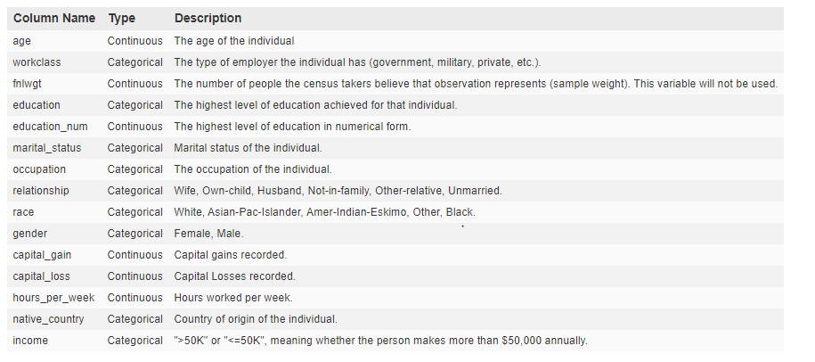

# Classification using Tensorflow :
## LinearClassifier
## Deep Neural Network Classifier

## Data:
We'll be working with some California Census Data, we'll be trying to use various features of an individual to predict what class of income they belogn in (>50k or <=50k). 

Here is some information about the data:

